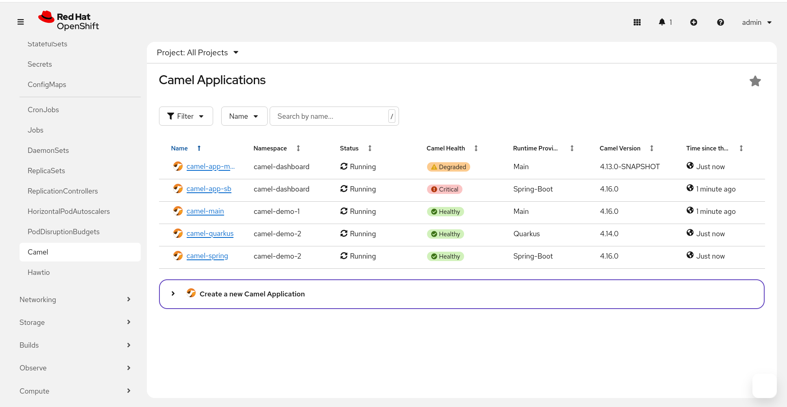
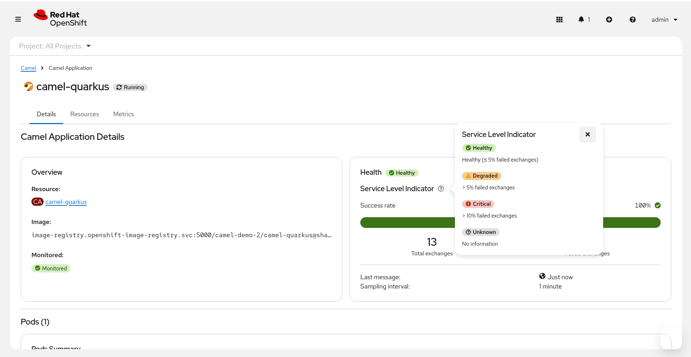

= Camel on OCP Best Practices - Camel Dashboard
:icons: font
:numbered:
:title: Best practice document for Camel Dashboard on OCP
:toc: left
:toclevels: 2
:source-highlighter: coderay

== Context

The https://camel-tooling.github.io/camel-dashboard/[Camel Dashboard] <<camel-dashboard>> is a Kubernetes-native tool designed to monitor and manage fleets of Apache Camel applications running on OpenShift. Born as a spin-off of Camel K, it provides a simple, low-resource solution for visualizing the health and performance of your Camel applications across your cluster.

The dashboard collects key performance indicators (KPIs) such as:

* Number of messages exchanged
* Success rates and failure counts
* Current in-flight message status
* Route health and performance metrics

This enables real-time operational insights and proactive management of your Camel integration applications.

== Camel Dashboard Components

The Camel Dashboard is composed of three main components, all installable via a single Helm chart:

* **Camel Dashboard Operator**: Manages Camel Dashboard instances and discovers Camel applications
* **Camel Dashboard Console**: OpenShift Console plugin providing integrated UI within the OCP web console
* **Hawtio Online Console Plugin**: Management and monitoring console for deep-dive Java application debugging

== Prerequisites

* OpenShift 4.19 or higher
* Apache Camel 4.9 or higher for full observability support
* Helm 3.x installed
* cluster-admin privileges for installation

== Installation

The recommended approach is to use the unified Helm chart that deploys all components:

[source,bash]
----
# Add the Camel Dashboard Helm repository
helm repo add camel-dashboard https://camel-tooling.github.io/camel-dashboard/charts

# Install all components in the camel-dashboard namespace
helm install camel-dashboard-openshift-all \
  camel-dashboard/camel-dashboard-openshift-all \
  --version 4.19.0 \
  -n camel-dashboard \
  --create-namespace
----

NOTE: The Helm chart version follows OpenShift versioning (X.Y.Z is compatible with OpenShift X.Y). Always use the latest patch version for your OpenShift release.

=== Selective Component Installation

If you want to install only specific components:

[source,bash]
----
# Install without Hawtio
helm install camel-dashboard-openshift-all \
  camel-dashboard/camel-dashboard-openshift-all \
  --version 4.19.0 \
  -n camel-dashboard \
  --create-namespace \
  --set hawtio-online-console-plugin.enabled=false

# Install only the operator
helm install camel-dashboard-openshift-all \
  camel-dashboard/camel-dashboard-openshift-all \
  --version 4.19.0 \
  -n camel-dashboard \
  --create-namespace \
  --set camel-dashboard-console.enabled=false \
  --set hawtio-online-console-plugin.enabled=false
----

== Preparing Camel Applications

For the Camel Dashboard to discover and monitor your applications, they must:

1. Use Camel 4.9 or higher
2. Include the Camel Observability Services component
3. Have proper labels and annotations configured

=== Adding Observability Services

==== Camel Quarkus

Add the observability services extension to your `pom.xml`:

[source,xml]
----
<dependency>
    <groupId>org.apache.camel.quarkus</groupId>
    <artifactId>camel-quarkus-observability-services</artifactId>
</dependency>
----

==== Camel Spring Boot

Add the observability services starter:

[source,xml]
----
<dependency>
    <groupId>org.apache.camel.springboot</groupId>
    <artifactId>camel-observability-services-starter</artifactId>
</dependency>
----

==== Camel JBang

Run with the `--observe` option:

[source,bash]
----
camel run MyRoute.java --observe
----

=== Configuring for Camel Dashboard Discovery

You will need to add add the required Kubernetes label to your Deployment manifest for the Camel Dashboard to discover your application:

[source,yaml]
----
apiVersion: apps/v1
kind: Deployment
metadata:
  labels:
    app: my-camel-app
    camel.apache.org/app: my-camel-app
----

For Camel versions older than 4.12, you must also configure the observability services port with the label: "camel.apache.org/observability-services-port: 8080"

You can find more advanced configuration for some fine tuning in the https://camel-tooling.github.io/camel-dashboard/docs/user-guide/[User Guide] <<camel-dashboard-user-guide>> 

== Using the Camel Dashboard

After installation and application deployment:

1. Navigate to the OpenShift Console
2. Look for the "Camel" section in the left navigation menu section "Workloads"
3. Access the Camel Dashboard to view your fleet of applications

.Camel Fleet on Openshift

.Camel Application detail on Openshift

== Troubleshooting

=== Applications Not Appearing in Dashboard

1. Verify the `camel.apache.org/app` label is present on the deployment
2. Check that Camel Observability Services is included in dependencies
3. Ensure observability endpoints are accessible (default port 9876)
4. Verify the application is running and healthy

=== Permission Issues

1. Check that users have appropriate RBAC permissions
2. Verify the console plugin is properly enabled in OpenShift
3. Review operator logs for discovery errors

[bibliography]
== Appendix

* [[[camel-dashboard,1]]] https://camel-tooling.github.io/camel-dashboard/
* [[[camel-dashboard-user-guide,2]]]https://camel-tooling.github.io/camel-dashboard/docs/user-guide/
* [[[camel-observability-services,3]]] https://camel.apache.org/components/next/others/observability-services.html
