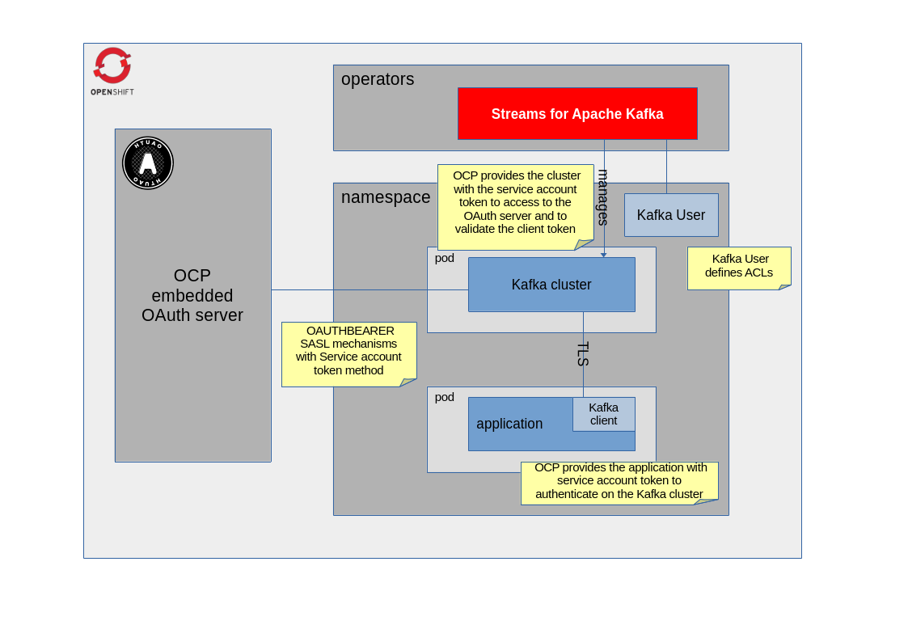

= Kafka OAuth with OpenShift embedded server
:icons: font
:numbered:
:title: Kafka OAuth with OpenShift embedded server
:toc: left
:toclevels: 2
:source-highlighter: coderay

== Context

OAuth flow is one of the authentication methods supported by https://docs.redhat.com/en/documentation/red_hat_streams_for_apache_kafka/latest/html/deploying_and_managing_streams_for_apache_kafka_on_openshift/assembly-securing-access-str#con-securing-kafka-authentication-str[Red Hat Streams for Apache Kafka], since OpenShift provides the embedded OAuth server, it could be interesting to understand how to integrate the products and how to configure a Camel application to act as a Kafka client.

== Prerequisites

- oc client https://docs.redhat.com/en/documentation/openshift_container_platform/latest/html/cli_tools/openshift-cli-oc[installed] to execute remote operations.
- already logged in into link:https://www.redhat.com/en/technologies/cloud-computing/openshift[**OpenShift**] (successfully running _oc login_)

== Goal

Provide a guide on how to configure a Kafka cluster using the `Red Hat Streams for Apache Kafka` operator, and how to configure a Camel application to authenticate/authorize to the Kafka cluster using the service account, without any other credentials.

== Usage

The Kafka cluster exposes a listener that needs a valid client `Bearer` token to be authenticated, and it needs to verify it by querying the OAuth server (using `jwksEndpointUri` property). The authentication to the OAuth server is granted by the local service account token provided in the Kafka cluster pod and configured with the `serverBearerTokenLocation` property, moreover the issuer can be different (eg: in not on-prem cloud) so please configure `validIssuerUri` properly with the claim `iss` of the client token. The TLS certificates exposed by the OCP API server are validated with the CA PEM file already mounted by default in the pod, and the Kafka properties are injected as environment variable using the pod template.

The application, in turn, authenticates to the Kafka cluster using its service account token, configured in the `camel.component.kafka.sasl-jaas-config` property. To trust the TLS certificates of the Kafka cluster the generated secret will be mounted in the application pod and the Camel properties will be injected as an environment variable.

The server finishes the login process identifying the user as defined in the property `userNameClaim`, this is the claim of the token to understand the user to be authorized.

Once the authentication has been done, the Kafka cluster verifies the permissions on the resource through the KafkaUser custom resource where the name matches the authenticated username.

For a practical example, you can follow our examples for both the runtimes supported by Red Hat Build
of Apache Camel. It shows how to configure the Kafka cluster and how to deploy the Camel applications

https://github.com/jboss-fuse/apache-camel-on-ocp-best-practices/tree/main/examples/ocp/kafka-oauth/[Camel on OCP Best practices - Kafka OAuth]

